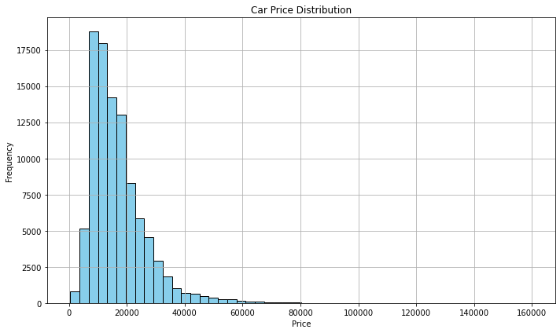

# ANALYZING VEHICLE TRENDS IN THE GLOBAL CAR MARKET

# PROJECT OVERVIEW

# PROBLEM STATEMENT
The global car market is constantly evolving, with significant shifts in consumer preferences, vehicle sales, and technological advancements. Companies and stakeholders in the automotive industry need insights into current trends and factors influencing vehicle popularity. This project aims to analyze trends in the global car market, identifying patterns in vehicle types, sales performance, and other market metrics over time to provide actionable insights for stakeholders.

# BUSINESS UNDERSTANDING
Automobile manufacturers, dealerships, and investors rely on data-driven insights to make strategic decisions. Understanding vehicle trends, consumer preferences, and factors influencing sales and production can help businesses optimize their product offerings, forecast market demand, and refine marketing strategies. By analyzing global car market data, we aim to uncover insights that can guide the production and marketing strategies of automotive companies to meet market demand more effectively.

# DATA UNDERSTNDING
The df_Cars DataFrame contains data related to vehicles sold globally. The dataset includes several key features such as vehicle type (sedan, SUV, truck, etc.), brand, sales volume, price, production year, and fuel efficiency, among others. An initial analysis reveals trends in vehicle sales across regions, with some car types showing more popularity in specific markets. The dataset will be cleaned and transformed to handle missing values, and categorical variables will be encoded for use in analysis.

# ANALYSIS
To analyze the global car market trends, we will begin by exploring the distribution of vehicle types, sales trends over the years, and price variations. A time series analysis will be conducted to identify sales trends across different regions and brands. Correlation analysis will help determine factors such as price, vehicle type, and fuel efficiency that influence sales performance. Data visualization techniques, such as bar plots, line charts, and heatmaps, will be used to present these findings, and clustering algorithms may be applied to group vehicles with similar characteristics.

# VISUALIZATIONS
1. price distribution

2.Average Price by Year
 

3.Mileage vs. Price

4. Plot of Fuel Types

# TABLEAU

# HYPOTHESIS TESTING
The ANOVA test shows that there are statistically significant differences in the average prices of cars across the different manufacturers in the dataset. Therefore, the manufacturer plays a key role in determining car price variation.

# DATA MODELING
This linear regression model attempts to predict car prices based on engine size. The MSE and R² values are important metrics that provide insight into the accuracy and performance of the model. Based on these values, you can assess whether engine size alone is a good predictor of car prices or whether additional features (e.g., mileage, year, fuel type) should be included to improve the model.

# CONCLUSION
1. Larger engines tend to increase a car’s price.
2. Different car manufacturers charge significantly different prices for their cars.
3. Price depreciates with increased usage.
4.  Fuel type affects both price and long-term operating costs.
5. Preferences for transmission types vary by market.

# RECCOMENDATION
### For Buyers:
Choose smaller engine sizes for lower upfront and maintenance costs.

Consider fuel type based on long-term cost savings (e.g., diesel vs. petrol vs. hybrid/electric).

Avoid high-mileage used cars if long-term reliability is a concern.

### For Dealers/Marketers:
Segment marketing campaigns by manufacturer and engine size.

Promote lower-mileage used cars at a premium.

Highlight fuel economy and tax savings for eco-friendly vehicles.

### For Manufacturers:

Continue investing in efficient engines with moderate sizes to balance cost and performance.

Use data insights to price models competitively based on market brand perception.